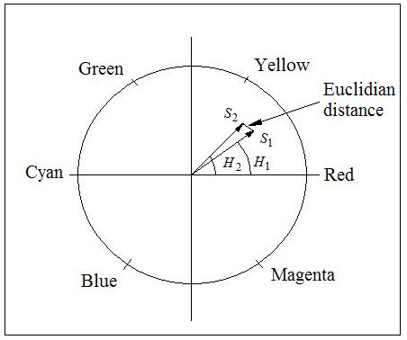
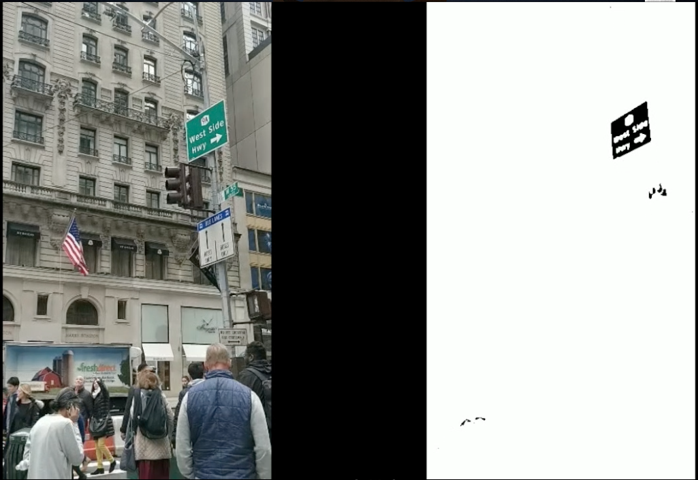
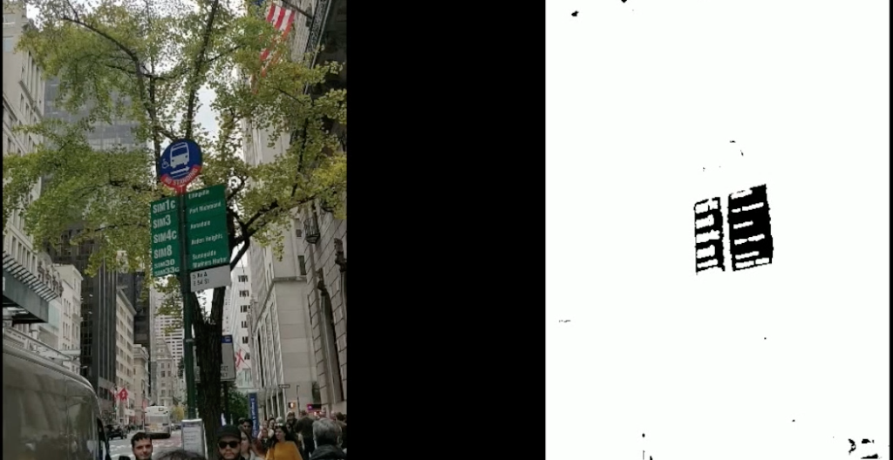
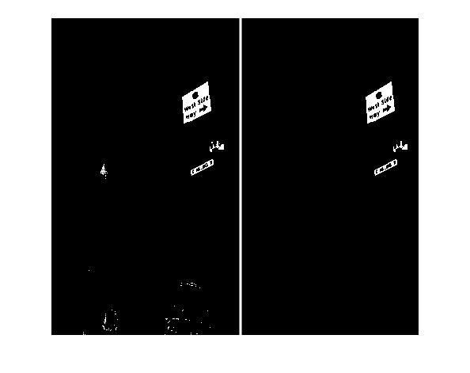
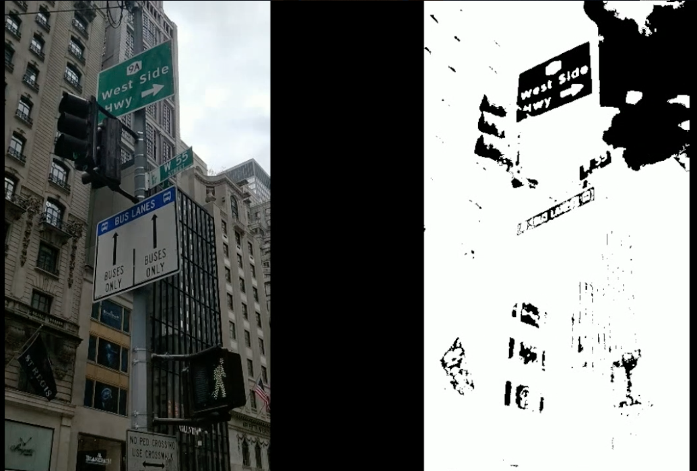

# StreetSign_Detection
Detecting Road and Street Name Signs from dynamic, high noise videos and classifing the detected road signs

## Motivation and Methdology Outline
With the advent of self-driving cars and autonomous delivery robots, identification of street name signs and traffic signs has become a problem of paramount importance.
In this project, we propose a lucid approach to tackle this problem.
The proposed method-ology  is  based  on  Dynamic  Thresholding  to  recognize  street  signs  effectively  undervarying conditions of illumination. 
The thresholding, however, is not performed on the RGB image space since the algorithm should be robust and invariant to factors such as illumination.
For this reason, we choose the HLS (Hue,Luminance,Saturation) imagespace as our primary workspace and implement a robust algorithm that is reasonably invariant to illumination.
Further, the thresholded images are made more accurate by employing strategic noise reduction techniques. 
This enables us to use a simple bound-ing box algorithm to extract the Region of Interest (RoI) after which a ConvolutionalNeural Network (CNN) is utilized to classify
the traffic signs into pre-defined classessuch as stop signs, speed limit signs, height clearance, etc.

The video is first parsed into images and is then fed to the detection algorithm which filters out the street sign on the basis of its color. This mainly depends on the
vector representation of colors in the hue circle.

After this, noise filtering is carried out to further enhance the feature/image ratio. 

The algorithm for detection has been implemented is `codes/Detection/StreetSignDetection.py`. 
There are other files for parsing the video into images and then stiching it back to the video as well.

The results can be seen in the images below:

 One of the drawbacks that arise due to the imaging device used.All test videos were shot on a smartphone camera (Model name:  OnePlus 5T).
 This camera has an in-built post-capture processing algorithm that is used to counter changing exposure values.
 This happens when the camera sensor is suddenly pointed at abright light source such as the sky in this case.
 When this happens, as is seen in the figure below,the smartphone automatically drops the S and L channel values for all pixels in the frame
 according to a predefined Auto Exposure (AE) adjustment algorithm. 
 Unless weknow the exact algorithm, which is proprietary of the manufacturer, it is impossible toaccount for this sudden change in theSchannel values,
 owing to which the sky crossesthe detection threshold and is included in the output for that frame.
 
 
